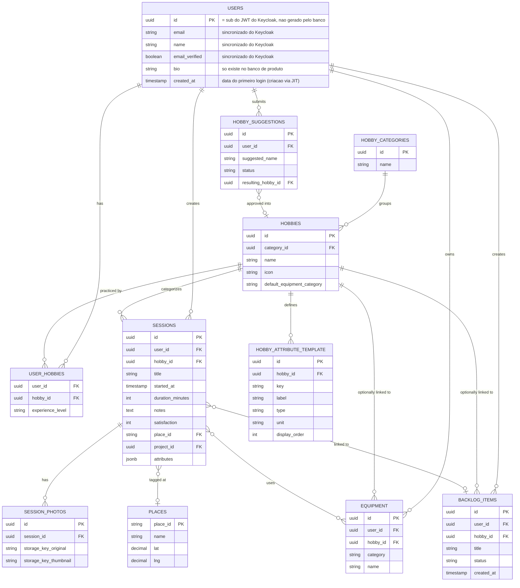

# Modelagem de Banco de Dados

> Nomes: tabelas/colunas em inglês. Diagrama 1 = escopo MVP. Diagrama 2 = modelo completo (Fase 1–4). Entidades marcadas "conceitual" = esqueleto do roadmap, sem coluna detalhada ainda — não implementar sem revisar antes.

---

## Diagrama 1 — Escopo MVP

---

## Diagrama 2 — Modelo Completo (Fase 1–4, conceitual)

```mermaid
erDiagram
    USERS ||--o{ USER_HOBBIES : has
    USERS ||--o{ SESSIONS : creates
    USERS ||--o{ EQUIPMENT : owns
    USERS ||--o{ BACKLOG_ITEMS : creates
    USERS ||--o{ HOBBY_SUGGESTIONS : submits

    HOBBIES ||--o{ USER_HOBBIES : "practiced by"
    HOBBIES ||--o{ SESSIONS : categorizes
    HOBBIES ||--o{ HOBBY_ATTRIBUTE_TEMPLATE : defines
    HOBBIES ||--o{ EQUIPMENT : "optionally linked to"

    SESSIONS ||--o{ SESSION_PHOTOS : has
    SESSIONS }o--o{ EQUIPMENT : uses
    SESSIONS }o--o| PLACES : "tagged at"
    SESSIONS }o--o| BACKLOG_ITEMS : "linked to"

    %% Fase 1 — colaboração
    USERS ||--o{ SESSION_PARTICIPANTS : joins
    SESSIONS ||--o{ SESSION_PARTICIPANTS : includes

    %% Fase 2 — efeito rede
    USERS ||--o{ USER_FOLLOWS : follows
    USERS ||--o{ LOCAL_RECOMMENDATIONS : posts
    PLACES ||--o{ LOCAL_RECOMMENDATIONS : "referenced by"
    USERS ||--o{ USER_LOCATION : "has current"

    %% Fase 3 — gamificação
    USERS ||--o{ HOBBY_XP : accumulates
    HOBBIES ||--o{ HOBBY_XP : "leveled in"

    %% Fase 4 — premium
    USERS ||--o{ SUBSCRIPTIONS : has
    USERS ||--o{ GOALS : sets
    USERS ||--o{ FAMILY_GROUP_MEMBERS : "belongs to"
    FAMILY_GROUPS ||--o{ FAMILY_GROUP_MEMBERS : includes
    USERS ||--o{ USER_BADGES : earns
    EQUIPMENT ||--o{ MAINTENANCE_ALERTS : triggers

    SESSION_PARTICIPANTS {
        uuid session_id FK
        uuid user_id FK
    }

    USER_FOLLOWS {
        uuid follower_id FK
        uuid followed_id FK
    }

    LOCAL_RECOMMENDATIONS {
        uuid id PK
        uuid user_id FK
        string place_id FK
        uuid hobby_id FK
        string type
    }

    USER_LOCATION {
        uuid user_id FK
        decimal lat
        decimal lng
        string geohash_bucket
    }

    HOBBY_XP {
        uuid user_id FK
        uuid hobby_id FK
        int xp
        string level_label
    }

    SUBSCRIPTIONS {
        uuid user_id FK
        string plan
        boolean active
    }

    GOALS {
        uuid id PK
        uuid user_id FK
        uuid hobby_id FK
        string description
    }

    FAMILY_GROUPS {
        uuid id PK
        string name
    }

    FAMILY_GROUP_MEMBERS {
        uuid family_group_id FK
        uuid user_id FK
    }

    USER_BADGES {
        uuid user_id FK
        string badge_key
    }

    MAINTENANCE_ALERTS {
        uuid id PK
        uuid equipment_id FK
        string alert_type
        timestamp triggered_at
    }
```

---

## Dicionário de Dados

### MVP

#### `users`
*Definida em conjunto com a decisão de autenticação (Keycloak). Não existe coluna de senha — credencial nunca é vista/armazenada pela aplicação, fica isolada dentro do Keycloak.*

| Coluna | Tipo | Nulo | FK | Observação |
|---|---|---|---|---|
| id | uuid | não | — | PK. **É o próprio `sub` do JWT do Keycloak**, não gerado pelo banco — evita coluna de mapeamento separada e mantém as FKs do resto do schema consistentes |
| email | string | não | — | sincronizado do Keycloak no momento do provisionamento just-in-time |
| name | string | não | — | sincronizado do Keycloak |
| email_verified | boolean | não | — | sincronizado do Keycloak; útil pra restringir alguma ação a e-mail confirmado |
| bio | string | sim | — | só existe no banco de produto, editado dentro do app |
| created_at | timestamp | não | — | data do primeiro login (linha criada via provisionamento JIT, não em cadastro separado) |

**Provisionamento**: não há sincronização em background — na primeira requisição autenticada de um usuário, se a linha ainda não existir em `users`, o backend cria ela na hora a partir dos campos do JWT (`sub`, `email`, `name`, `email_verified`).

#### `hobby_categories`

| Coluna | Tipo | Nulo | FK | Observação |
|---|---|---|---|---|
| id | uuid | não | — | PK |
| name | string | não | — | ex: "Esportes", "Artes" |

#### `hobbies`

| Coluna | Tipo | Nulo | FK | Observação |
|---|---|---|---|---|
| id | uuid | não | — | PK |
| category_id | uuid | não | `hobby_categories.id` | |
| name | string | não | — | |
| icon | string | sim | — | |
| default_equipment_category | string | sim | — | sugestão de categoria de equipamento ao cadastrar item pra esse hobby |

#### `user_hobbies`
Lista de hobbies do perfil + nível de experiência.

| Coluna | Tipo | Nulo | FK | Observação |
|---|---|---|---|---|
| user_id | uuid | não | `users.id` | PK composta com hobby_id |
| hobby_id | uuid | não | `hobbies.id` | |
| experience_level | string | sim | — | |

#### `hobby_attribute_template`
Define quais atributos dinâmicos existem por hobby (Alternativa C).

| Coluna | Tipo | Nulo | FK | Observação |
|---|---|---|---|---|
| id | uuid | não | — | PK |
| hobby_id | uuid | não | `hobbies.id` | |
| key | string | não | — | chave técnica, ex: `pages`, `distance_km` |
| label | string | não | — | rótulo exibido ao usuário |
| type | string | não | — | `number`, `text`, `select`... |
| unit | string | sim | — | ex: `km`, `páginas` |
| display_order | int | não | — | |

#### `sessions`

| Coluna | Tipo | Nulo | FK | Observação |
|---|---|---|---|---|
| id | uuid | não | — | PK |
| user_id | uuid | não | `users.id` | |
| hobby_id | uuid | não | `hobbies.id` | |
| title | string | não | — | front sugere default |
| started_at | timestamp | não | — | |
| duration_minutes | int | não | — | |
| notes | text | sim | — | campo único (notas + reflexão, unificados) |
| satisfaction | int | não | — | 1–5, obrigatório |
| place_id | string | sim | `places.place_id` | opcional |
| project_id | uuid | sim | `backlog_items.id` | opcional |
| attributes | jsonb | sim | — | valores dos atributos dinâmicos, validados contra `hobby_attribute_template` |

#### `session_photos`

| Coluna | Tipo | Nulo | FK | Observação |
|---|---|---|---|---|
| id | uuid | não | — | PK |
| session_id | uuid | não | `sessions.id` | |
| storage_key_original | string | não | — | key no R2 |
| storage_key_thumbnail | string | não | — | gerado async, WebP, sem EXIF |

#### `places`
Cache de lugares resolvidos via Google Place Details.

| Coluna | Tipo | Nulo | FK | Observação |
|---|---|---|---|---|
| place_id | string | não | — | PK, vem do Google |
| name | string | não | — | |
| lat | decimal | não | — | |
| lng | decimal | não | — | |

#### `equipment`
Biblioteca de equipamentos do usuário. **Categoria e nome são duas colunas independentes do mesmo registro, não chave/valor.**

| Coluna | Tipo | Nulo | FK | Observação |
|---|---|---|---|---|
| id | uuid | não | — | PK |
| user_id | uuid | não | `users.id` | |
| hobby_id | uuid | sim | `hobbies.id` | vínculo opcional |
| category | string | não | — | select fixo/curado (lista ainda não enumerada) |
| name | string | não | — | texto livre, com autocomplete pelo histórico do próprio usuário |

#### `session_equipment`
Tabela de junção — equipamento usado numa sessão específica.

| Coluna | Tipo | Nulo | FK | Observação |
|---|---|---|---|---|
| session_id | uuid | não | `sessions.id` | PK composta |
| equipment_id | uuid | não | `equipment.id` | |

#### `backlog_items`
Fila de projetos (Kanban) — mesma entidade referenciada por `sessions.project_id`.

| Coluna | Tipo | Nulo | FK | Observação |
|---|---|---|---|---|
| id | uuid | não | — | PK |
| user_id | uuid | não | `users.id` | |
| hobby_id | uuid | sim | `hobbies.id` | |
| title | string | não | — | |
| status | string | não | — | ex: `pending`, `in_progress`, `done` |
| created_at | timestamp | não | — | |

#### `hobby_suggestions`
Fila de moderação pra crescimento da taxonomia.

| Coluna | Tipo | Nulo | FK | Observação |
|---|---|---|---|---|
| id | uuid | não | — | PK |
| user_id | uuid | não | `users.id` | |
| suggested_name | string | não | — | texto livre |
| status | string | não | — | `pending`, `approved`, `rejected` |
| resulting_hobby_id | uuid | sim | `hobbies.id` | preenchido se aprovado |

---

### Fase 1 — Identidade do App *(conceitual)*

#### `session_participants`
Suporte a sessões colaborativas/em grupo.

| Coluna | Tipo | Nulo | FK | Observação |
|---|---|---|---|---|
| session_id | uuid | não | `sessions.id` | PK composta |
| user_id | uuid | não | `users.id` | participante convidado |

---

### Fase 2 — Efeito Rede *(conceitual, depende de massa crítica de usuários)*

#### `user_follows`
Base do feed social.

| Coluna | Tipo | Nulo | FK | Observação |
|---|---|---|---|---|
| follower_id | uuid | não | `users.id` | |
| followed_id | uuid | não | `users.id` | |

#### `local_recommendations`
"Onde pratico" / "o que indico".

| Coluna | Tipo | Nulo | FK | Observação |
|---|---|---|---|---|
| id | uuid | não | — | PK |
| user_id | uuid | não | `users.id` | |
| place_id | string | não | `places.place_id` | |
| hobby_id | uuid | sim | `hobbies.id` | |
| type | string | não | — | ex: `pratico`, `indico` |

#### `user_location`
Localização atual aproximada, base pra "hobby buddy" e heatmap.

| Coluna | Tipo | Nulo | FK | Observação |
|---|---|---|---|---|
| user_id | uuid | não | `users.id` | PK |
| lat | decimal | sim | — | |
| lng | decimal | sim | — | |
| geohash_bucket | string | sim | — | precisão baixa, pra agregação anônima |

---

### Fase 3 — Gamificação *(conceitual)*

#### `hobby_xp`

| Coluna | Tipo | Nulo | FK | Observação |
|---|---|---|---|---|
| user_id | uuid | não | `users.id` | PK composta |
| hobby_id | uuid | não | `hobbies.id` | |
| xp | int | não | — | curva de XP por categoria, ainda não definida |
| level_label | string | não | — | ex: "Botânico Urbano" |

---

### Fase 4 — Premium *(conceitual)*

#### `subscriptions`

| Coluna | Tipo | Nulo | FK | Observação |
|---|---|---|---|---|
| user_id | uuid | não | `users.id` | PK |
| plan | string | não | — | |
| active | boolean | não | — | |

#### `goals`
Metas avançadas / desafios com IA.

| Coluna | Tipo | Nulo | FK | Observação |
|---|---|---|---|---|
| id | uuid | não | — | PK |
| user_id | uuid | não | `users.id` | |
| hobby_id | uuid | sim | `hobbies.id` | |
| description | text | não | — | |

#### `family_groups` / `family_group_members`
Multi-perfil de família ou casal.

| Coluna | Tipo | Nulo | FK | Observação |
|---|---|---|---|---|
| id | uuid | não | — | PK (`family_groups`) |
| name | string | não | — | |
| family_group_id | uuid | não | `family_groups.id` | (`family_group_members`) |
| user_id | uuid | não | `users.id` | (`family_group_members`) |

#### `user_badges`
Customização de perfil / conquistas.

| Coluna | Tipo | Nulo | FK | Observação |
|---|---|---|---|---|
| user_id | uuid | não | `users.id` | |
| badge_key | string | não | — | |

#### `maintenance_alerts`
Inventário com alerta de manutenção/validade.

| Coluna | Tipo | Nulo | FK | Observação |
|---|---|---|---|---|
| id | uuid | não | — | PK |
| equipment_id | uuid | não | `equipment.id` | |
| alert_type | string | não | — | |
| triggered_at | timestamp | não | — | |

---

## Itens em Aberto

- Lista final de categorias de equipamento (enum de `equipment.category`).
- Curva de XP por categoria de hobby (`hobby_xp.xp`).
- Estrutura completa das entidades marcadas como conceituais (Fases 1–4) — servem de esqueleto, não de especificação fechada.
- Índices e constraints específicos (fora do escopo desta modelagem inicial).
