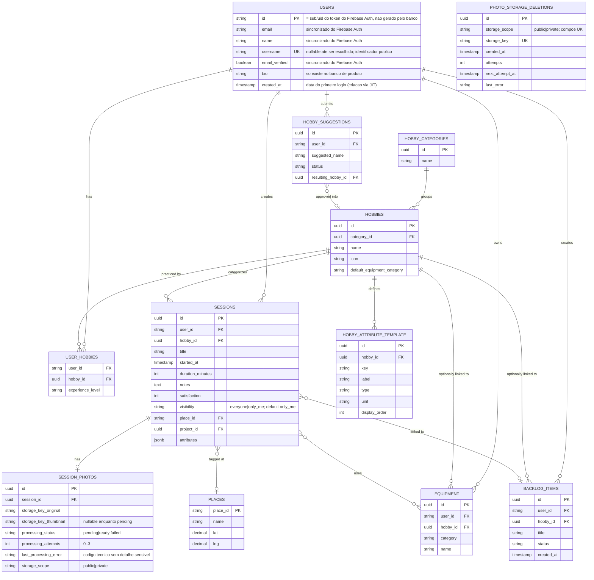

# Modelagem de Banco de Dados

> Nomes: tabelas/colunas em inglês. Diagrama 1 = escopo MVP. Diagrama 2 = modelo completo. Gamificação pessoal e fundação Plus foram revisadas para implementação; colaboração, efeito de rede, família e IA continuam conceituais.

---

## Diagrama 1 — Escopo MVP

---

## Diagrama 2 — Modelo Completo (Fase 1–4, conceitual)

```mermaid
erDiagram
    USERS ||--o{ USER_HOBBIES : has
    USERS ||--o{ SESSIONS : creates
    USERS ||--o{ EQUIPMENT : owns
    USERS ||--o{ BACKLOG_ITEMS : creates
    USERS ||--o{ HOBBY_SUGGESTIONS : submits

    HOBBIES ||--o{ USER_HOBBIES : "practiced by"
    HOBBIES ||--o{ SESSIONS : categorizes
    HOBBIES ||--o{ HOBBY_ATTRIBUTE_TEMPLATE : defines
    HOBBIES ||--o{ EQUIPMENT : "optionally linked to"

    SESSIONS ||--o{ SESSION_PHOTOS : has
    SESSIONS }o--o{ EQUIPMENT : uses
    SESSIONS }o--o| PLACES : "tagged at"
    SESSIONS }o--o| BACKLOG_ITEMS : "linked to"

    %% Fase 1 — colaboração
    USERS ||--o{ SESSION_PARTICIPANTS : joins
    SESSIONS ||--o{ SESSION_PARTICIPANTS : includes

    %% Fase 2 — efeito rede
    USERS ||--o{ USER_FOLLOWS : follows
    USERS ||--o{ LOCAL_RECOMMENDATIONS : posts
    PLACES ||--o{ LOCAL_RECOMMENDATIONS : "referenced by"
    USERS ||--o{ USER_LOCATION : "has current"

    %% Fase 1 — gamificação pessoal
    USERS ||--o{ HOBBY_XP : accumulates
    HOBBIES ||--o{ HOBBY_XP : "leveled in"
    USERS ||--o{ GOALS : sets
    HOBBIES ||--o{ GOALS : "optionally scopes"
    USERS ||--o{ USER_BADGES : earns
    USER_BADGES ||--o| USER_FEATURED_BADGES : features

    %% Fundação Plus
    USERS ||--o| SUBSCRIPTIONS : has
    USERS ||--o{ FAMILY_GROUP_MEMBERS : "belongs to"
    FAMILY_GROUPS ||--o{ FAMILY_GROUP_MEMBERS : includes
    EQUIPMENT ||--o{ EQUIPMENT_MAINTENANCE_RULES : has

    SESSION_PARTICIPANTS {
        uuid session_id FK
        string user_id FK
    }

    USER_FOLLOWS {
        string follower_id FK
        string followed_id FK
    }

    LOCAL_RECOMMENDATIONS {
        uuid id PK
        string user_id FK
        string place_id FK
        uuid hobby_id FK
        string type
    }

    USER_LOCATION {
        string user_id FK
        decimal lat
        decimal lng
        string geohash_bucket
    }

    HOBBY_XP {
        string user_id FK
        uuid hobby_id FK
        int xp
        int level
        string level_label
        timestamp updated_at
    }

    SUBSCRIPTIONS {
        string user_id FK
        string plan
        string status
        string provider
        string external_subscription_id
        timestamp current_period_end
    }

    GOALS {
        uuid id PK
        string user_id FK
        uuid hobby_id FK
        string name
        string metric
        int target_value
        string cadence
        date start_date
        date end_date
        string status
        boolean advanced
    }

    FAMILY_GROUPS {
        uuid id PK
        string name
    }

    FAMILY_GROUP_MEMBERS {
        uuid family_group_id FK
        string user_id FK
    }

    USER_BADGES {
        uuid id PK
        string user_id FK
        string badge_key
        uuid hobby_id FK
        timestamp earned_at
    }

    USER_FEATURED_BADGES {
        string user_id FK
        uuid badge_id FK
        int position
    }

    EQUIPMENT_MAINTENANCE_RULES {
        uuid id PK
        uuid equipment_id FK
        string name
        int interval_minutes
        timestamp last_maintained_at
        boolean active
    }
```

---

## Dicionário de Dados

### MVP

#### `users`
*Definida em conjunto com a decisão de autenticação (Firebase Authentication). Não existe coluna de senha — credencial nunca é vista/armazenada pela aplicação, fica isolada dentro do provedor de auth. Como o Firebase usa `uid` string por padrão, `users.id` e suas FKs relacionadas a usuário também são string.*

| Coluna | Tipo | Nulo | FK | Observação |
|---|---|---|---|---|
| id | string | não | — | PK. **É o próprio `sub`/`uid` do token do Firebase Authentication**, não gerado pelo banco — evita coluna de mapeamento separada e mantém as FKs do resto do schema consistentes |
| email | string | não | — | sincronizado do Firebase Authentication no momento do provisionamento just-in-time |
| name | string | não | — | sincronizado do Firebase Authentication |
| username | string | sim | — | identificador público único case-insensitive, 3–30 caracteres; pode ficar `null` até usuário provisionado escolher; nunca usar o UID na URL pública |
| email_verified | boolean | não | — | sincronizado do Firebase Authentication; útil pra restringir alguma ação a e-mail confirmado |
| bio | string | sim | — | só existe no banco de produto, editado dentro do app |
| created_at | timestamp | não | — | data do primeiro login (linha criada via provisionamento JIT, não em cadastro separado) |
| profile_theme | string | não | — | tema cosmético; default `default`, alteração exige Plus |

**Provisionamento**: não há sincronização em background — na primeira requisição autenticada de um usuário, se a linha ainda não existir em `users`, o backend cria ela na hora a partir dos campos do token validado (`sub`/`uid`, `email`, `name`, `email_verified`).

#### `hobby_categories`

| Coluna | Tipo | Nulo | FK | Observação |
|---|---|---|---|---|
| id | uuid | não | — | PK |
| name | string | não | — | ex: "Esportes", "Artes" |
| xp_session_bonus | int | não | — | bônus por sessão usado na projeção de XP |
| xp_minutes_per_point | int | não | — | minutos necessários por XP nesta categoria |

#### `hobbies`

| Coluna | Tipo | Nulo | FK | Observação |
|---|---|---|---|---|
| id | uuid | não | — | PK |
| category_id | uuid | não | `hobby_categories.id` | |
| name | string | não | — | |
| icon | string | sim | — | |
| default_equipment_category | string | sim | — | sugestão de categoria de equipamento ao cadastrar item pra esse hobby |

#### `user_hobbies`
Lista de hobbies do perfil + nível de experiência.

| Coluna | Tipo | Nulo | FK | Observação |
|---|---|---|---|---|
| user_id | string | não | `users.id` | PK composta com hobby_id |
| hobby_id | uuid | não | `hobbies.id` | |
| experience_level | string | sim | — | |

#### `hobby_attribute_template`
Define quais atributos dinâmicos existem por hobby (Alternativa C).

| Coluna | Tipo | Nulo | FK | Observação |
|---|---|---|---|---|
| id | uuid | não | — | PK |
| hobby_id | uuid | não | `hobbies.id` | |
| key | string | não | — | chave técnica, ex: `pages`, `distance_km` |
| label | string | não | — | rótulo exibido ao usuário |
| type | string | não | — | `number`, `text`, `select`... |
| unit | string | sim | — | ex: `km`, `páginas` |
| display_order | int | não | — | |

#### `sessions`

| Coluna | Tipo | Nulo | FK | Observação |
|---|---|---|---|---|
| id | uuid | não | — | PK |
| user_id | string | não | `users.id` | |
| hobby_id | uuid | não | `hobbies.id` | |
| title | string | não | — | front sugere default |
| started_at | timestamp | não | — | |
| duration_minutes | int | não | — | |
| notes | text | sim | — | campo único (notas + reflexão, unificados) |
| satisfaction | int | não | — | 1–5, obrigatório |
| visibility | string | não | — | `everyone` ou `only_me`, default `only_me`; modelado como enum extensível para `followers` na Fase 2, mas esse valor ainda não é aceito |
| place_id | string | sim | `places.place_id` | opcional |
| project_id | uuid | sim | `backlog_items.id` | opcional |
| attributes | jsonb | sim | — | valores dos atributos dinâmicos, validados contra `hobby_attribute_template` |

**Mapeamento atual na aplicação**: `sessions.attributes` está mapeado no backend como `Map<String, Object>` usando Hibernate ORM nativo com `@JdbcTypeCode(SqlTypes.JSON)` e coluna PostgreSQL `jsonb`. Até o estado atual do projeto, esse caminho atende ao MVP sem dependência de lib extra.

#### `session_photos`

| Coluna | Tipo | Nulo | FK | Observação |
|---|---|---|---|---|
| id | uuid | não | — | PK |
| session_id | uuid | não | `sessions.id` | |
| storage_key_original | string | não | — | key no R2 |
| storage_key_thumbnail | string | sim | — | `null` enquanto o processamento está pendente; depois aponta para thumbnail WebP sem EXIF |
| processing_status | string | não | — | `pending`, `ready` ou `failed`; nunca simular thumbnail copiando a key original |
| processing_attempts | int | não | — | contador de tentativas, de 0 a 3 |
| last_processing_error | string | sim | — | somente classe/código técnico resumido; não armazena mensagem de provedor ou segredo |
| storage_scope | string | não | — | `private` ou `public`; indica em qual bucket estão as variantes atuais |

`storage_key_original` e `session_id` são únicos, garantindo no máximo uma foto por sessão também no banco. A remoção de uma foto dispara, na mesma transação, a inclusão do par `storage_scope` + keys atual/original e thumbnail em `photo_storage_deletions`; isso evita apagar no bucket errado e preserva a intenção de limpeza quando o R2 estiver indisponível.

#### `photo_storage_deletions`

| Campo | Tipo | Nulo? | Restrição | Descrição |
|---|---|---:|---|---|
| id | UUID | não | PK | identificador da tarefa de limpeza |
| storage_scope | string | não | unique composto | `public` ou `private`, seleciona o bucket correto |
| storage_key | string | não | unique composto | objeto R2 a remover de forma idempotente; unique junto de `storage_scope` |
| created_at | timestamptz | não | — | instante de criação da tarefa |
| attempts | int | não | >= 0 | tentativas já realizadas |
| next_attempt_at | timestamptz | não | índice | próxima execução com backoff |
| last_error | string | sim | — | somente classe/código técnico, sem mensagem sensível |

#### `places`
Cache de lugares resolvidos via Google Place Details.

| Coluna | Tipo | Nulo | FK | Observação |
|---|---|---|---|---|
| place_id | string | não | — | PK, vem do Google |
| name | string | não | — | |
| lat | decimal | não | — | |
| lng | decimal | não | — | |

#### `equipment`
Biblioteca de equipamentos do usuário. **Categoria e nome são duas colunas independentes do mesmo registro, não chave/valor.**

| Coluna | Tipo | Nulo | FK | Observação |
|---|---|---|---|---|
| id | uuid | não | — | PK |
| user_id | string | não | `users.id` | |
| hobby_id | uuid | sim | `hobbies.id` | vínculo opcional |
| category | string | não | — | select fixo/curado (lista ainda não enumerada) |
| name | string | não | — | texto livre, com autocomplete pelo histórico do próprio usuário |

#### `session_equipment`
Tabela de junção — equipamento usado numa sessão específica.

| Coluna | Tipo | Nulo | FK | Observação |
|---|---|---|---|---|
| session_id | uuid | não | `sessions.id` | PK composta |
| equipment_id | uuid | não | `equipment.id` | |

#### `backlog_items`
Fila de projetos (Kanban) — mesma entidade referenciada por `sessions.project_id`.

| Coluna | Tipo | Nulo | FK | Observação |
|---|---|---|---|---|
| id | uuid | não | — | PK |
| user_id | string | não | `users.id` | |
| hobby_id | uuid | sim | `hobbies.id` | |
| title | string | não | — | |
| status | string | não | — | ex: `pending`, `in_progress`, `done` |
| created_at | timestamp | não | — | |
| due_date | date | sim | — | planejamento Plus |
| priority | string | não | — | `low`, `normal`, `high`; default `normal` |
| archived | boolean | não | — | arquivamento Plus sem excluir histórico |
| position | int | não | — | ordenação estável dentro do status |

#### `hobby_suggestions`
Fila de moderação pra crescimento da taxonomia.

| Coluna | Tipo | Nulo | FK | Observação |
|---|---|---|---|---|
| id | uuid | não | — | PK |
| user_id | string | não | `users.id` | |
| suggested_name | string | não | — | texto livre |
| status | string | não | — | `pending`, `approved`, `rejected` |
| resulting_hobby_id | uuid | sim | `hobbies.id` | preenchido se aprovado |

---

### Fase 1 — Identidade do App *(conceitual)*

#### `session_participants`
Suporte a sessões colaborativas/em grupo.

| Coluna | Tipo | Nulo | FK | Observação |
|---|---|---|---|---|
| session_id | uuid | não | `sessions.id` | PK composta |
| user_id | string | não | `users.id` | participante convidado |

---

### Fase 2 — Efeito Rede *(conceitual, depende de massa crítica de usuários)*

#### `user_follows`
Base do feed social.

| Coluna | Tipo | Nulo | FK | Observação |
|---|---|---|---|---|
| follower_id | string | não | `users.id` | |
| followed_id | string | não | `users.id` | |

#### `local_recommendations`
"Onde pratico" / "o que indico".

| Coluna | Tipo | Nulo | FK | Observação |
|---|---|---|---|---|
| id | uuid | não | — | PK |
| user_id | string | não | `users.id` | |
| place_id | string | não | `places.place_id` | |
| hobby_id | uuid | sim | `hobbies.id` | |
| type | string | não | — | ex: `pratico`, `indico` |

#### `user_location`
Localização atual aproximada, base pra "hobby buddy" e heatmap.

| Coluna | Tipo | Nulo | FK | Observação |
|---|---|---|---|---|
| user_id | string | não | `users.id` | PK |
| lat | decimal | sim | — | |
| lng | decimal | sim | — | |
| geohash_bucket | string | sim | — | precisão baixa, pra agregação anônima |

---

### Fase 1 — Gamificação pessoal *(revisada para implementação)*

#### `hobby_xp`

| Coluna | Tipo | Nulo | FK | Observação |
|---|---|---|---|---|
| user_id | string | não | `users.id` | PK composta |
| hobby_id | uuid | não | `hobbies.id` | |
| xp | int | não | — | projeção conforme parâmetros da categoria |
| level | int | não | — | derivado dos thresholds documentados |
| level_label | string | não | — | label genérico inicial |
| updated_at | timestamp | não | — | última reconstrução |

`hobby_xp` é projeção reconstruível; `sessions` permanece fonte da verdade.

#### `goals`

| Coluna | Tipo | Nulo | FK | Observação |
|---|---|---|---|---|
| id | uuid | não | — | PK |
| user_id | string | não | `users.id` | proprietário |
| hobby_id | uuid | sim | `hobbies.id` | obrigatório no Free; meta global é Plus |
| name | string | não | — | 1–120 caracteres |
| metric | string | não | — | `sessions` ou `minutes` |
| target_value | int | não | — | positivo |
| cadence | string | não | — | `weekly`, `monthly`, `custom` |
| start_date | date | não | — | UTC |
| end_date | date | não | — | UTC, inclusivo |
| status | string | não | — | `active`, `completed`, `archived` |
| advanced | boolean | não | — | criação/alteração exige Plus |
| created_at | timestamp | não | — | auditoria |

Progresso é derivado das sessões. Conta Free aceita uma meta semanal ativa por hobby no período corrente; metas semanais encerradas não bloqueiam a semana seguinte. A criação é serializada por usuário+hobby para evitar duas metas Free concorrentes.

#### `user_badges`

| Coluna | Tipo | Nulo | FK | Observação |
|---|---|---|---|---|
| id | uuid | não | — | PK |
| user_id | string | não | `users.id` | proprietário |
| badge_key | string | não | — | chave do catálogo server-side |
| hobby_id | uuid | sim | `hobbies.id` | escopo específico opcional |
| earned_at | timestamp | não | — | primeiro desbloqueio |

Unique lógico por usuário, chave e hobby, tratando `null` como escopo global. Badge conquistado não é removido por edição posterior.

#### `user_featured_badges`

| Coluna | Tipo | Nulo | FK | Observação |
|---|---|---|---|---|
| user_id | string | não | `users.id` | PK com `position` |
| badge_id | uuid | não | `user_badges.id` | FK composta com `user_id`; ownership também é garantido pelo banco |
| position | int | não | — | 1–3 |

---

### Fundação Plus *(revisada; cobrança ainda pendente)*

#### `subscriptions`

| Coluna | Tipo | Nulo | FK | Observação |
|---|---|---|---|---|
| user_id | string | não | `users.id` | PK |
| plan | string | não | — | `plus`; ausência equivale a Free |
| status | string | não | — | `active`, `past_due`, `canceled`, `expired` |
| provider | string | sim | — | `null` até decisão do provedor |
| external_subscription_id | string | sim | — | opaco, nunca exposto publicamente |
| current_period_end | timestamp | sim | — | validade comercial |
| updated_at | timestamp | não | — | auditoria |

#### `family_groups` / `family_group_members`
Multi-perfil de família ou casal.

| Coluna | Tipo | Nulo | FK | Observação |
|---|---|---|---|---|
| id | uuid | não | — | PK (`family_groups`) |
| name | string | não | — | |
| family_group_id | uuid | não | `family_groups.id` | (`family_group_members`) |
| user_id | string | não | `users.id` | (`family_group_members`) |

#### `equipment_maintenance_rules`
Inventário com alerta de manutenção/validade.

| Coluna | Tipo | Nulo | FK | Observação |
|---|---|---|---|---|
| id | uuid | não | — | PK |
| equipment_id | uuid | não | `equipment.id` | |
| name | string | não | — | regra do proprietário |
| interval_minutes | int | não | — | positivo |
| last_maintained_at | timestamp | sim | — | início da janela; `null` usa todo histórico |
| active | boolean | não | — | pausa sem apagar |
| created_at | timestamp | não | — | auditoria |

O alerta é calculado com `session_equipment` e sessões posteriores à última manutenção.

---

## Itens em Aberto

- Lista final de categorias de equipamento (enum de `equipment.category`).
- Labels temáticos de nível por hobby; a fórmula inicial já está em `gamificacao-e-planos.md`.
- Estrutura completa das entidades ainda conceituais: colaboração, seguidores, família, IA e templates comunitários.
- Índices e constraints adicionais das entidades ainda conceituais, definidos somente quando cada fase for implementada.
